# SAMS - Student Attendance Management System

A Java-based desktop application built to manage student attendance in educational institutions. 
This system was designed and developed individually as part of the OOP module coursework at IJSE, 
applying object-oriented design principles and layered architecture concepts learned throughout the module.

---

## Project Overview

SAMS provides a complete solution for managing student attendance in an educational environment. 
The system supports two user roles — Admin and Lecturer — each with their own dedicated portal 
and access controls.

As an admin, you can manage courses, subjects, students, and lecturers, schedule classes, 
and view attendance reports. As a lecturer, you can view your assigned subjects and schedule, 
and mark attendance for your sessions.

---

## Technologies Used

| Technology | Version |
|---|---|
| Java | 21 |
| JavaFX | 21 |
| MySQL | 8.0 |
| JDBC | MySQL Connector 8.3.0 |
| Maven | 3.11.0 |
| Ikonli Icons | 12.3.1 |
| NetBeans IDE | 29 |

---

## Architecture

This application follows a **Layered (N-Tier) Architecture** as required by the coursework guidelines:

- **Presentation Layer** — JavaFX FXML views and controllers handle all UI interactions
- **Service Layer** — Business logic is handled within controller classes
- **Data Access Layer** — JDBC handles all database communication via DBConnection singleton
- **Database Layer** — MySQL relational database with 8 normalized tables

The **Singleton Pattern** is used for DBConnection and SessionManager to ensure a single 
shared instance across the application.

---

## Setup Instructions

### Prerequisites
- Java JDK 21 or higher
- MySQL Server 8.0
- Maven 3.6+
- NetBeans IDE 29 (recommended)

### Database Setup
1. Open **MySQL Workbench**
2. Run the `sams_db.sql` file located in the root of this project
3. This will automatically create the database, all 8 tables, and insert sample data

### Application Setup
1. Clone the repository: git clone https://github.com/OshaniKavindya01/SAMS.git
2. Open the project in **NetBeans IDE**
3. Update your database password in: src/main/java/lk/ijse/sams/db/DBConnection.java
4. 4. Right-click the project → **Clean and Build**
5. Click **Run**

---

## Login Credentials

| Role | Username | Password |
|---|---|---|
| Admin | admin | admin123 |
| Lecturer | nimal.jayawardena.lec | nimal123 |
| Lecturer | dilani.rathnayake.lec | dilani123 |
| Lecturer | kasun.perera.lec | kasun123 |

> **Note:** When adding a new lecturer through the system, the username is 
> auto-generated as `firstname.lastname.lec` and the default password is `firstname123`

---

## Features

### Admin Portal
- **Course Management** — Add, update, and delete courses
- **Subject Management** — Manage subjects linked to each course
- **Student Management** — Register students with course enrollment and contact details
- **Lecturer Management** — Add lecturers with auto-generated login credentials
- **Class Scheduling** — Schedule sessions with course, subject, lecturer, date and time
- **Attendance Marking** — Mark each student as Present, Absent, or Late per session
- **Attendance Reports** — Filter reports by student, subject, and date range
- **My Profile** — View and update admin email, change password

### Lecturer Portal
- **My Subjects** — View only subjects assigned to the logged-in lecturer
- **My Schedule** — View only sessions assigned to the logged-in lecturer
- **Mark Attendance** — Mark and update attendance for their own sessions only

---

## Screenshots

### Login Screen
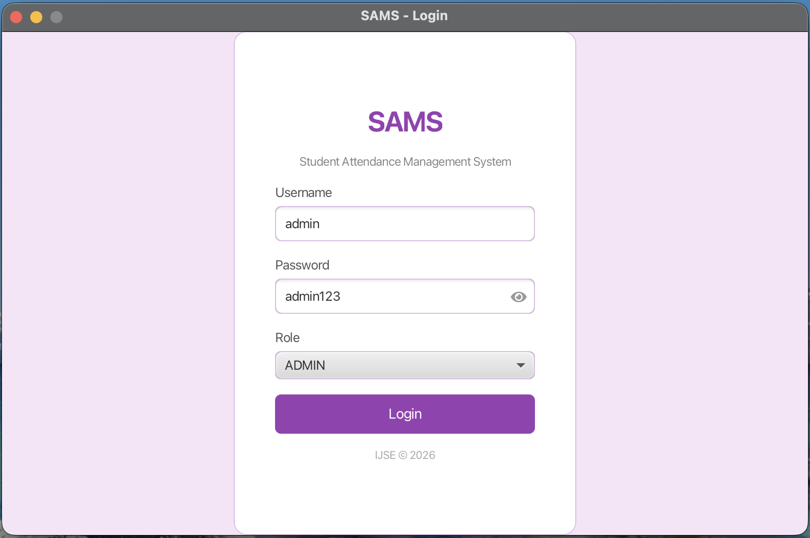

### Student Management
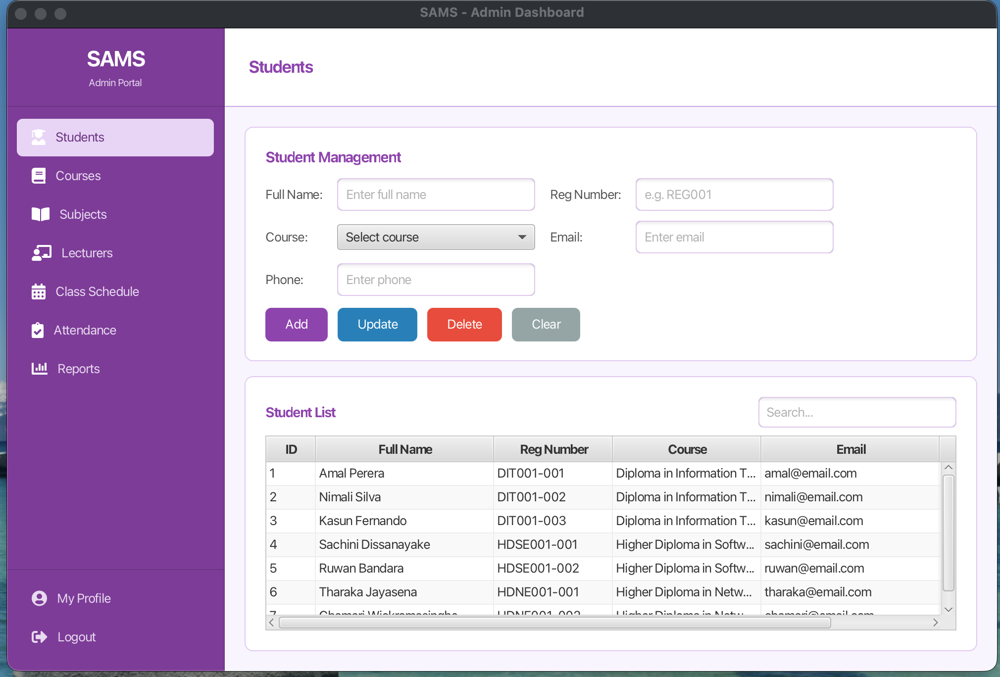

### Course Management
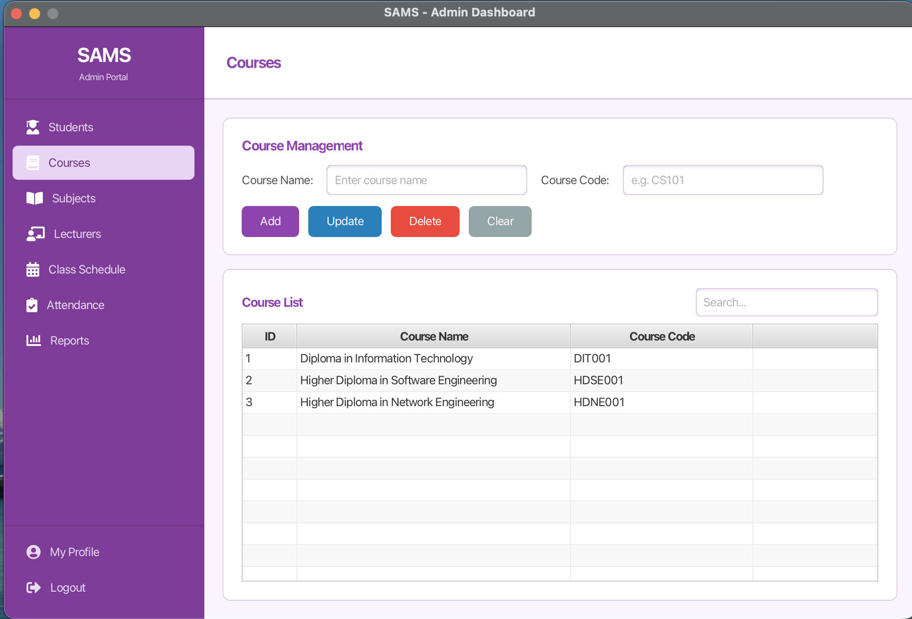

### Subject Management
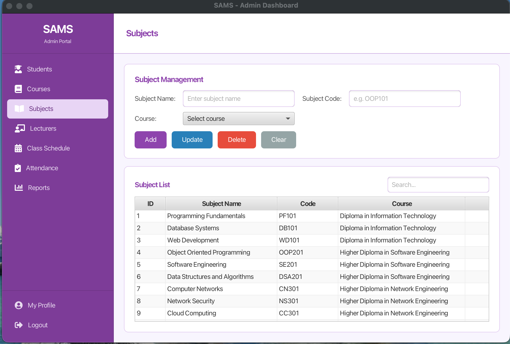

### Lecturer Management
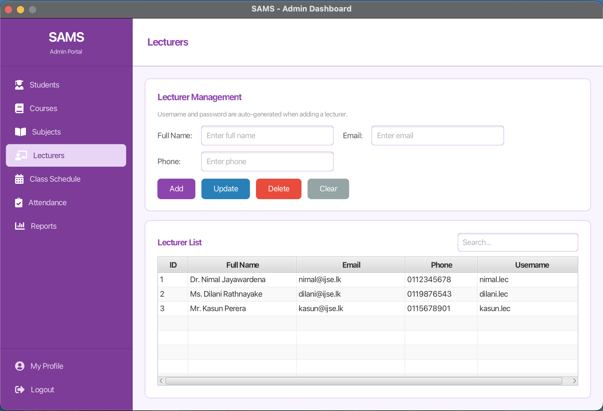

### Class Schedule
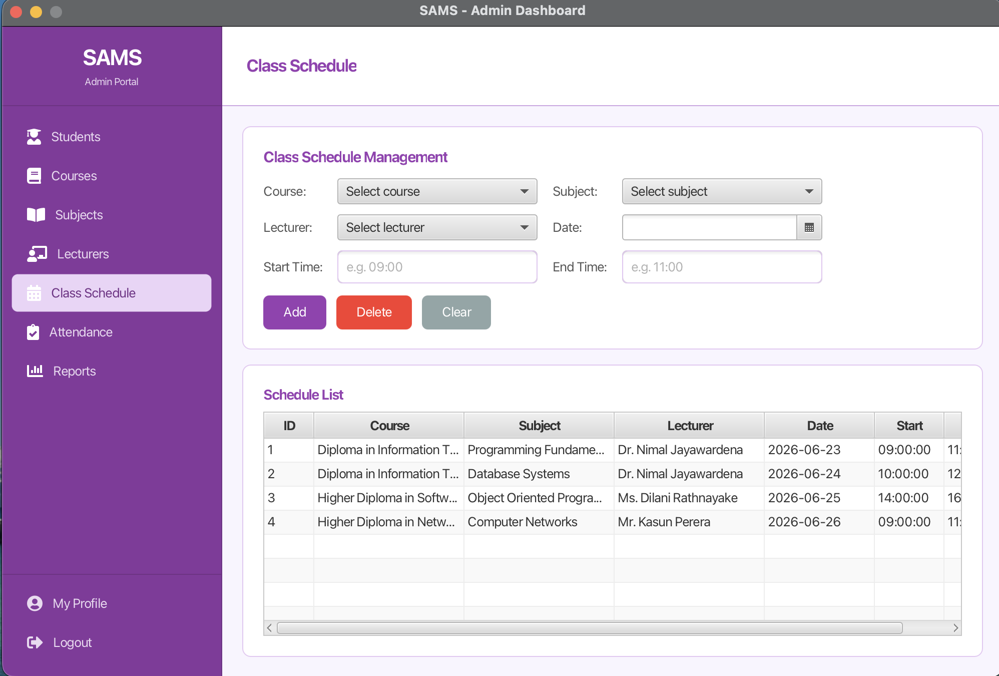

### Attendance Marking
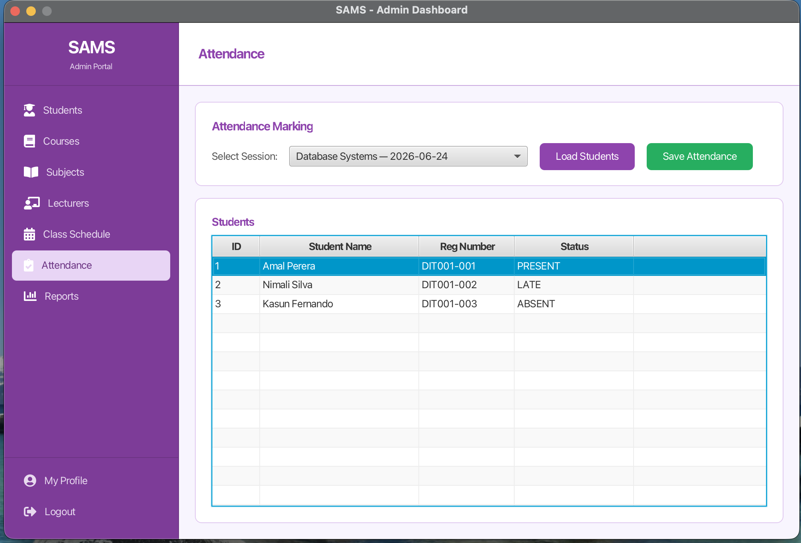

### Attendance Reports
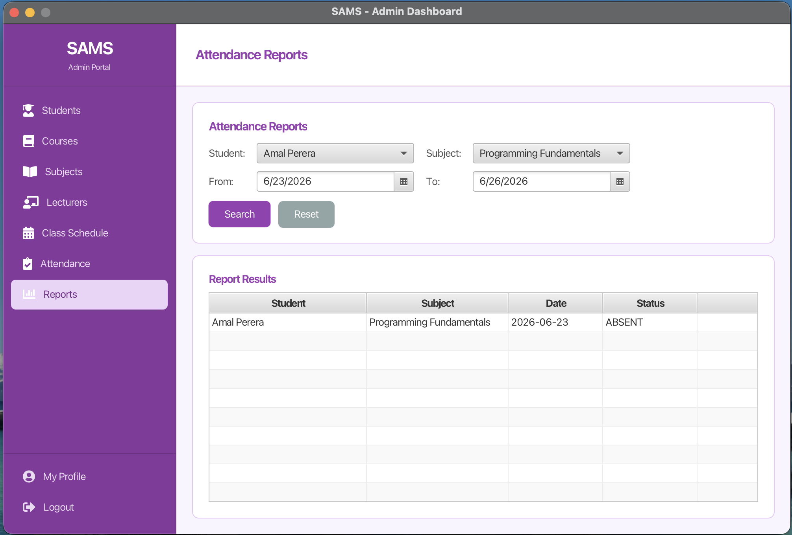

### My Profile
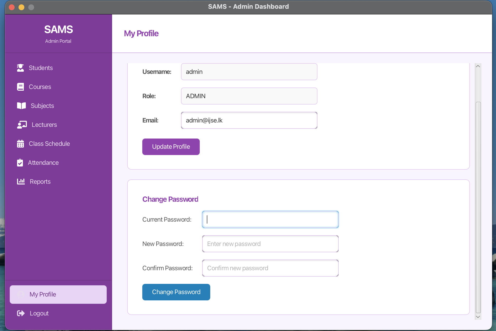

### Lecturer Portal
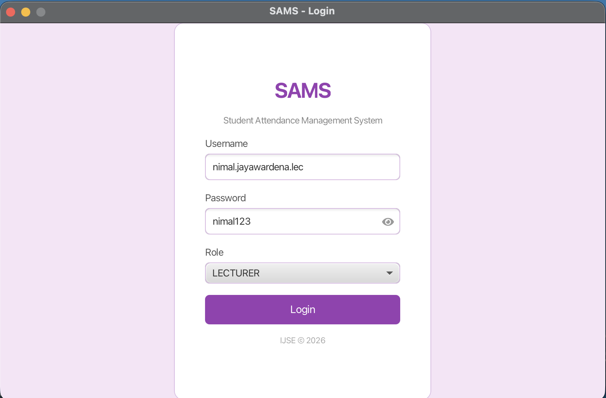

### Lecturer - My Subjects
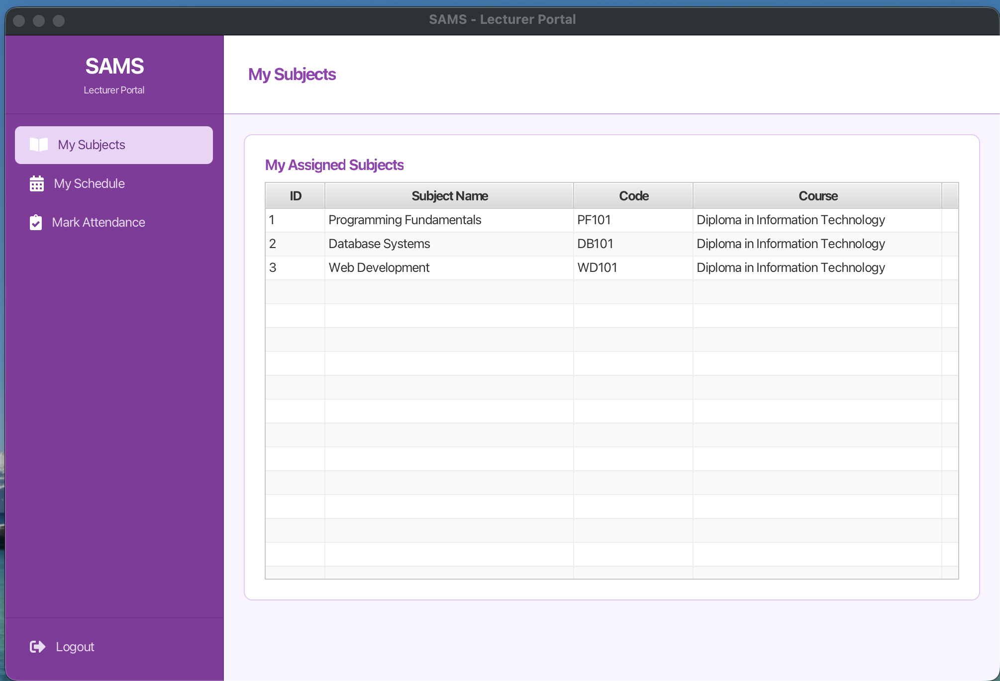

### Lecturer - My Schedule
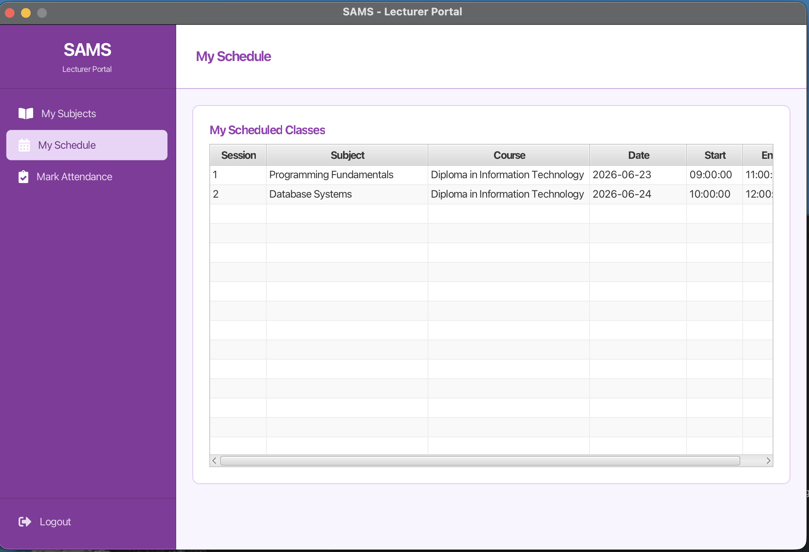

### Lecturer - Mark Attendance
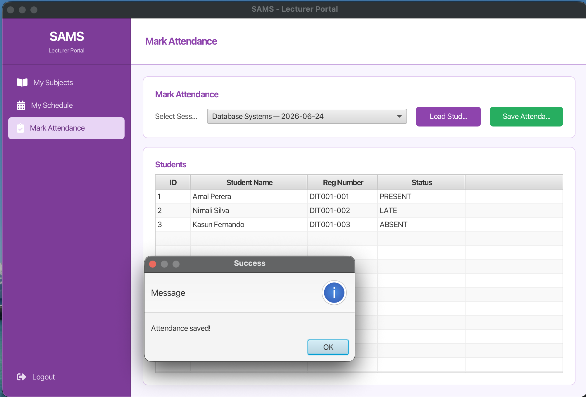

---

## Database Schema

The system uses **8 relational tables** with proper primary keys, foreign keys, and constraints:

| Table | Description |
|---|---|
| users | Login credentials and roles |
| courses | Course information |
| subjects | Subjects linked to courses |
| students | Student profiles and enrollment |
| lecturers | Lecturer profiles |
| lecturer_subjects | Many-to-many: lecturers and subjects |
| class_sessions | Scheduled class sessions |
| attendance | Per-student attendance per session |

---

## Project Structure

src/main/java/lk/ijse/sams/

├── App.java

├── controller/        — UI controllers for each module

├── model/             — Entity classes (Student, Course, Lecturer, etc.)

└── db/                — DBConnection singleton
src/main/resources/lk/ijse/sams/

└── *.fxml             — FXML layout files for each view

---

## OOP Concepts Applied

- **Encapsulation** — All model classes use private fields with getters/setters
- **Inheritance** — JavaFX controller hierarchy
- **Singleton Pattern** — DBConnection and SessionManager
- **Layered Architecture** — Separation of UI, business logic, and data access
- **Role-Based Access Control** — Different views and permissions per user role

---

## Author
*Oshani Kavindya** 
---
